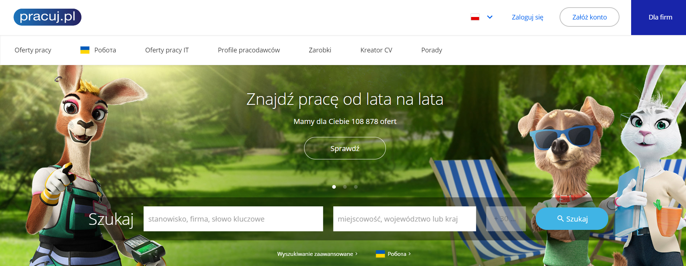
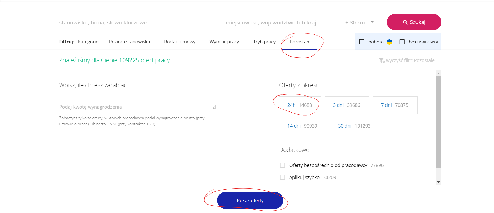
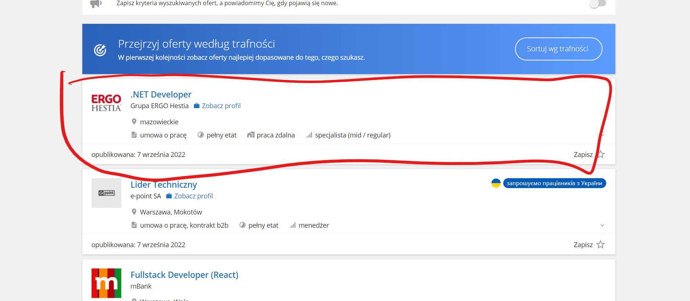
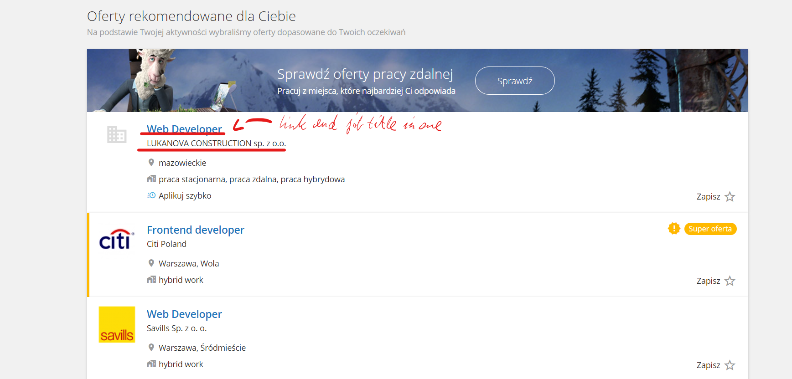

# ⭐ Simple example of web scraping with Selenium in Python  

# PROJECT IS OUT OF MAINTENANCE

Support open source software and help me in further development. Thank you for every donation and star!

### 💡 What is it? 
The program make automated search on pracuj.pl website to find interesting job offers according to keyword and location. Then, each job offer from search result is being collected. Subsequently result is exported through Pandas to create beautiful .xlsx file full of job offers. At the final step the .xlsx file is send to given email. 

We are starting here: 
 
To get the result: 
 

### :gear: How it works?
! The automation happens with use of Selenium.  
We want to get to the section with advanced search and do appropriate scraping of job offers. 
1. Find advanced search and click it. 

2. Find specific fields to enter keyword and location. 

3. Find "Pozostałe" (it means other) button and click it to add additional details to our search. We want to find only new offers (added within 24 hours). Then find and click the button that contains "Pokaż oferty"(Show offers). 

4. Collect each job offer from every page of result as block of "offer info". 
 
If there is more than one page of result: find next page button and until exists go to the next page to once again collect job offers. 

5. Get job title, website with details and company name from each block with offer info. 

6. Create table from gathered data and export it to excel.
7. Send the complete message with .xlsx attachment to recipient address.
8. DONE!

### :thinking: How to use it? 
* Setup a virtual envinronment inside clone directory
* Install modules from requirements.txt with:
    pip install -r requirements.txt
* Update variables: 
    * searchKeyword 
    * searchLocation
    * adblockPath - my is: 
        C:\Users\nazyw\AppData\Local\Google\Chrome\User Data\Default\Extensions\gighmmpiobklfepjocnamgkkbiglidom
    * senderAddress 
    * senderKey - app key from you gmail account to authenticate use of your gmail account (e.g. Gmail, can be other)
    * receiverAddress 
* Run main.py in IDE of your choice 
* Admire how amazing Selenium is 
